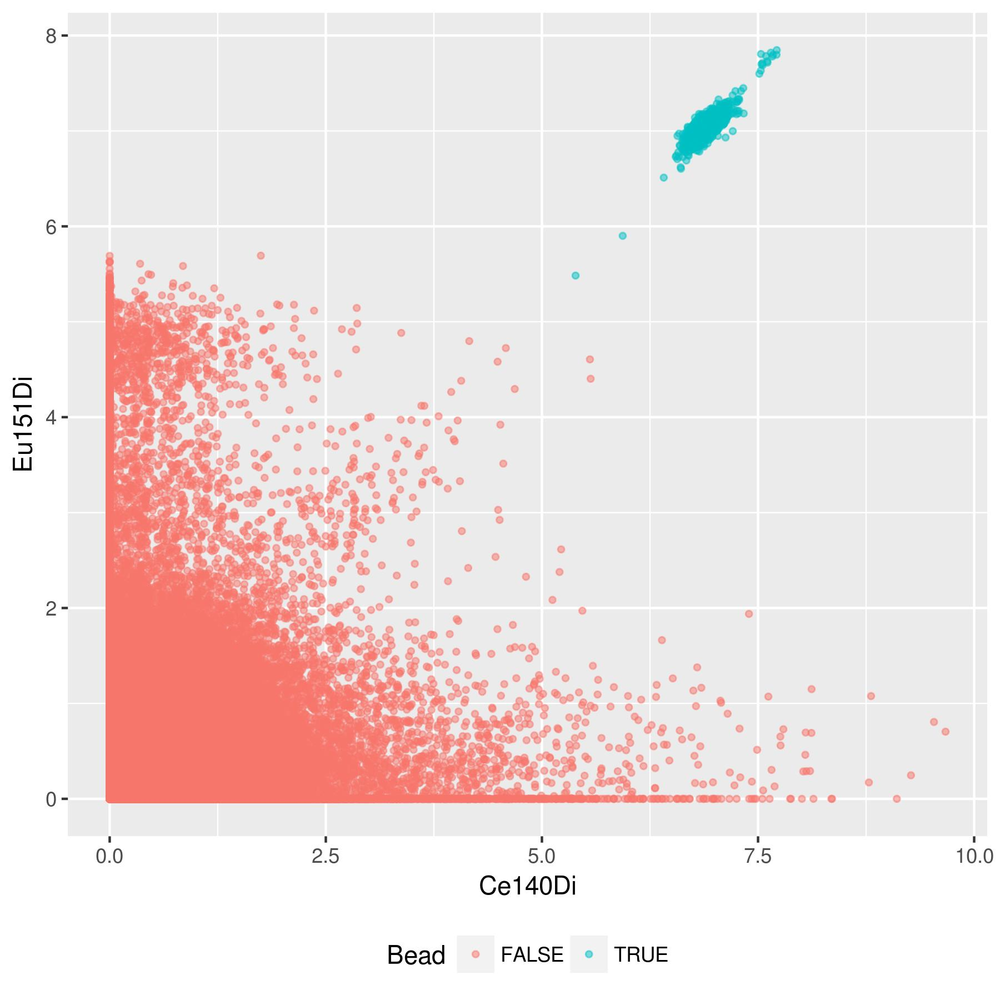
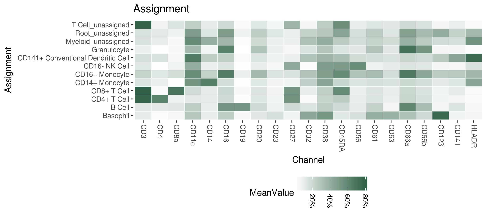
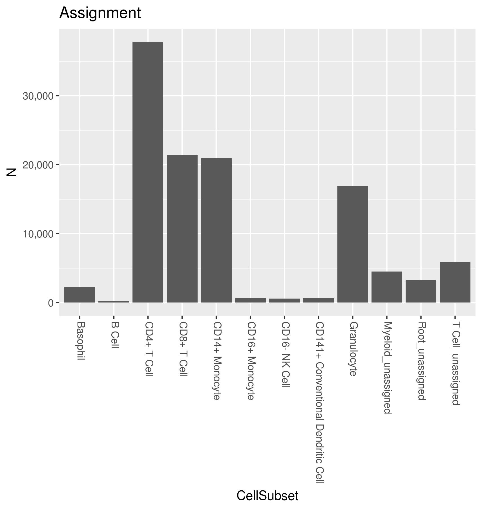
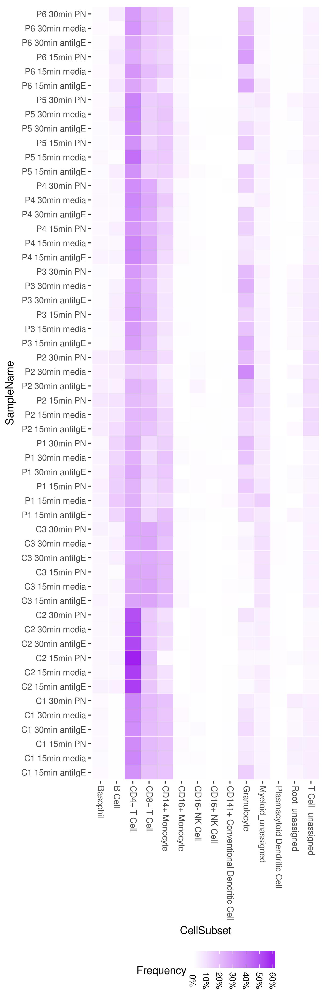
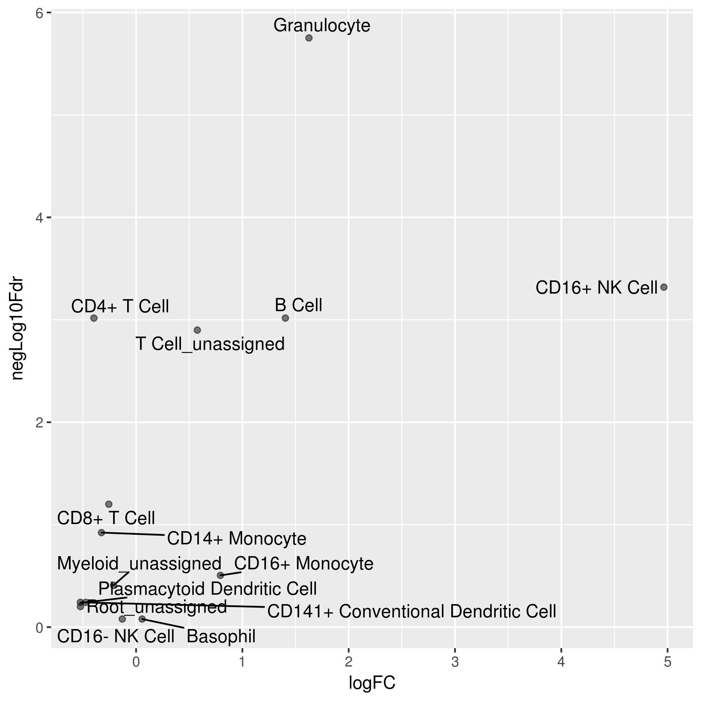
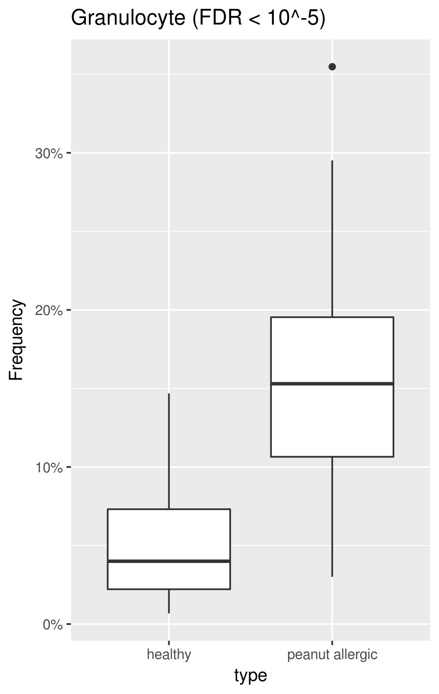
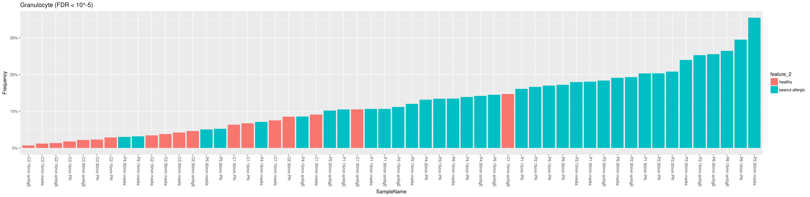

# Introduction to the Astrolabe Platform Export

Astrolabe Diagnostics provides complete access to the analysis conducted by the platform. In addition to browsing through the Astrolabe app, you are welcome to download the experiment export file, `experiment.zip`. This file includes all analysis results in various formats.

> Throughout this guide technical notes appear in blockquote.
>
> The examples here use data from [Tordesillas et al., J Allergy Clin Immunol, 2016](https://www.ncbi.nlm.nih.gov/pubmed/27531074). You can download the raw data from [the FlowRepository repo](https://flowrepository.org/id/FR-FCM-ZZTW), or download the [Astrolabe `experiment.zip` file]().

**TODO update link to file above**

The file includes the following directories:

- `/analysis/fcs`. FCS output of the Astrolabe automatic gating tool.
- `/reports/`. Figures and CSV files for each sample and for the experiment analyses.
- `/analysis/`. RDS files which can be loaded in R using the `orloj` package.

Each of these directories is further explored in the following sections.

> Sample-specific results are identified using the sample name that was entered when configuring the experiment in Astrolabe.

## Automatic Gating FCS Files

The `/analysis/fcs` directory includes the output of the Astrolabe automatic gating tool. Each of the sample FCS files is exported to a separate directory whose name is the sample name. Within the directory of a given sample, you will find a set of FCS files, one for each of the cell subsets that were identified for this sample. These are standard FCS files and you can load them in any other software, the same way you would load any other CyTOF or flow cytometry FCS file.

> Astrolabe follows a hierarchical automated gating algorithm. Briefly, all cells begin in a `Root` level. Cells are then iteratively classified into subsets of their current level until each cell belongs to a terminal label. As an example, a cell could start at `Root`, then get classified as `Myeloid`, and finally as `CD16+ Monocyte`.
>
> The platform offers two types of terminal labels. The `Assignment` level terminal labels follow a manually curated cell subset hierarchy which is built separately from the data set. The `Profiling` level extends the `Assignment` labels through an agnostic classification step that looks for strong separation within the data (across samples). For example, in the Tordesillas et al. data set, `CD16+ Monocyte` cells were further classified as `CD16+ Monocyte CD66a+` and `CD16+ Monocyte CD66a-`.

Within a sample directory, the file names follow the syntax `[sample_file_name].[subset].fcs`. The sample file name is the same as the file that was uploaded to the platform during experiment setup. The subset corresponds to the cell subset, as classified by the `Assignment` level. Each cell is exported to the lowest level subset for it. For example, if a cell was classified as both a `T Cell` and a `CD4+ T Cell`, it will be exported to `[sample_file_name].CD4__T_Cell.fcs`.

Several files warrant special attention. `[sample_name].bead.fcs` has the CyTOF calibration beads that were identified by Astrolabe. `[sample_name].Debris.fcs` has any events were negative for all major subset markers -- these are treated as debris by Astrolabe. `[sample_name].Root_unassigned.fcs` has events that were positive for at least one major subset marker, but could not be classified into any subset.

## Reports

The `/reports/` directory includes figures (in JPEG format) and CSV files for each of the experiment samples. The reports for each sample are exported in a directory with that sample name. In addition, `/reports/` includes two experiment-wide reports: `experiment_cell_counts`, which includes cell subset counts over all samples, and `differential_abundance_analysis`, which includes the result of the differential abundance analysis.

### Sample Report Directories

Each sample report directory includes three sub-directories.

If any CyTOF calibration beads were identified for the sample, biaxial plots that report on the bead gate will be exported to `/reports/[sample_name]/beads/`. The biaxial plots correspond to Ce140 versus Eu151, Ho165, and Lu175, covering the four elements that constitute the beads. Blue dots are bead events and red dots are non-bead events.

*CD140 versus Eu151 for sample `C1 15min antiIgE`. Beads are in blue, non-bead events are in red.*

Cell assignment heatmaps are available in `/reports/[sample_name]/cell_assignments/`. There are heatmap files for the `Assignment` and `Profiling` gating levels. In each of heatmap, the X-axis corresponds to classification channels (as supplied during experiment setup), the Y-axis corresponds to cell subsets, and tile values are the median intensity of that channel in that subset. Channel intensities are scaled to a 0..100% range in order to clearly visualize varying intensities across channels.

*Assignment level heatmap for C1 15min antiIgE*

In addition to the JPEG figure, each level includes a CSV file with the data that was used to generate the figure, such as [`Assignment.jpg.csv`](examples/cell_assignments_Assignment.jpg.csv) for the heatmap above.

Finally, cell subset counts for the two gating levels are in `/reports/[sample_name]/subset_counts/`, along with respective CSVs such as [`Assignment.jpg.csv`](examples/cell_counts_Assignment.jpg.csv).

*Assignment level cell counts barplot for C1 15min antiIgE*

### Experiment Cell Counts

Figures visualizing subset cell counts across all samples in the experiment can be found in the `/reports/experiment_cell_counts/` directory. As before, Astrolabe exports reports for the `Assignment` and `Profiling` levels separately.

For each level, you will find a subset cell count heatmap ([and the accommodating CSV file](examples/frequency_heatmap.jpg.csv)). Here, the X-axis corresponds to cell subsets, the Y-axis corresponds to samples, and tile values are the frequency of that subset in that channel.

*Subset cell counts for all samples in Tordesillas et al.*

For a clearer view of the cell frequencies for each given subset, consult the `/bar_plots/` directory for each level, which includes a separate bar plot for each subset (<a href="examples/CD4+ T Cell.jpg.csv">and, of course, the CSV file</a>).

*CD4+ T Cell frequencies across all samples in Tordesillas et al.*

### Differential Abundance Analysis

Astrolabe utilizes the [edgeR](http://bioconductor.org/packages/release/bioc/html/edgeR.html) package for differential abundance analysis. We analyze each sample feature separately -- in this experiment, each of the patient, type, condition, and timepoint features will be tested. Within each feature, we would like to know whether the abundance (cell count) of each cell subset is different between feature values. In other words, we are asking "are granulocyte counts different between healthy controls and peanut allergic patients?", "are B cell counts different?", etc.

> The analysis is run for each of the label levels (so there is an `Assignment` analysis and a `Profiling` analysis).
>
> P values are adjusted for multiple comparisons using the Benjamini-Hochberg procedure, which is commonly referred to as FDR.

By default, the analysis is not paired: feature values are tested under the assumption that each sample is independent from all the others. However, a common pairing in experiment design is patient (for example, same patient, before or after treatment). If an experiment includes the `Patient` feature, then features will follow a paired analysis (which could improve P values dramatically).

> Only features that are independent from the `Patient` feature will be paired. Using Tordesillas et al. as an example, the `Type` feature is **dependent** on `Patient` (patients are either healthy controls or peanut allergic). The `Condition` feature is **independent** on `Patient`, since the same patient sample could be treated using anti IgE or peanut extract.

Differential abundance analysis figures are under the `/reports/differential_subset_analysis/` directory, which has a sub-directory for the `Assignment` and `Profiling` levels (similarly to the experiment cell counts figures). These are further sub-divided to the different features.

If a feature has only two values (such as `Type` in this experiment, which is either healthy or allergic), its directory will include a volcano plot:

*Volcano plot for the Type feature. Several cell subsets, such as granulocytes, have differential abundances.*

You can examine the relationship for a given cell subset using either a boxplot or a barplot:

*A boxplot of granulocyte cell counts for different patient types. Peanut allergic patients have higher granulocyte counts.*

*A barplot of granulcoyte frequencies for all patients. The peanut allergic patients are concentrated in higher frequencies.*

> As before, all of the above figures have a respective CSV file with the data that was used to generate them.

## Analysis

The `/analysis/` directory includes a set of analysis RDS files for each of the experiment samples, and several experiment-wide RDS files. These files include all of the analyses done by the Astrolabe platform, and can be loaded into R using the `orloj` package. Please consult the [package README.md file](README.md) for explanations on how to install and operate `orloj`.
